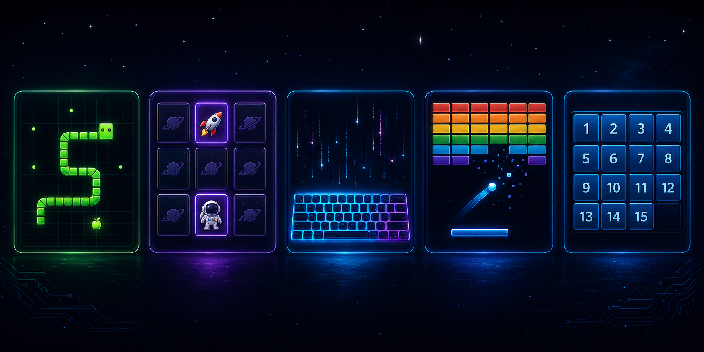

# biswajit-minigames



🌐 **Live:** [biswajit1999.github.io/biswajit-minigames](https://biswajit1999.github.io/biswajit-minigames/)

A small collection of browser mini games I built as part of a casual learning process — spending free time exploring game mechanics, JavaScript canvas, and DOM interactions, with AI assistance along the way.

All games are **self-contained HTML files** — no build tools, no npm, no server required. Just open any file in a browser and play.

The hub (`index.html`) has a refined dark gallery interface with fluid typography and spacing, so it renders crisply on anything from a laptop screen to a 4K display.

---

## Games

| Game | File | Controls | Description |
|---|---|---|---|
| 🐍 Neon Serpent | `games/snake.html` | Arrow Keys / WASD | Classic snake. Eat food, avoid walls and yourself. Speed scales with score. |
| 🌌 Cosmos Match | `games/memory-cards.html` | Mouse | Flip card pairs to find matches. Choose 4×4 or 6×4 difficulty. |
| ⌨️ Swift Keys | `games/typing-speed.html` | Keyboard | Type passages and measure your WPM + accuracy in real time. |
| 🔵 Photon Breaker | `games/breakout.html` | Mouse | Bounce a ball to break all bricks. Multi-hit bricks on higher levels. |
| 🧩 Gravity Shift | `games/sliding-tile.html` | Mouse | Sliding tile puzzle in 3×3, 4×4, or 5×5 — all shuffles are solvable. |

---

## How to play

**Option 1 — Open directly:**  
Double-click `index.html` to open the game hub, then click any game card. An internet connection is only needed the first time for the hub's fonts — everything else works fully offline.

**Option 2 — Live site:**  
[biswajit1999.github.io/biswajit-minigames](https://biswajit1999.github.io/biswajit-minigames/)

---

## Structure

```
biswajit-minigames/
├── index.html           ← game selection hub
├── README.md
└── games/
    ├── snake.html
    ├── memory-cards.html
    ├── typing-speed.html
    ├── breakout.html
    └── sliding-tile.html
```

---

## About

This repo is a side project — a casual way to spend free time while picking up bits of HTML5 Canvas, CSS animation, and vanilla JavaScript game loops. Each game is designed and built with AI assistance as part of the learning process. The collection grows over time; new games get added regularly. Everything is intentionally simple and dependency-free so it stays easy to read, modify, and extend.

---

*Biswajit Jana · 2026*
